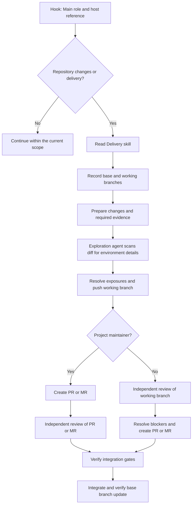

# Instruction And Hook Design

## Separate The Audiences

Keep contributor guidance separate from consumer instructions so the plugin does not impose this repository's toolchain on other projects.

| Source | Audience | Responsibility |
| --- | --- | --- |
| `AGENTS.md` | Contributors | Contributors follow repository conventions, validation, and publication requirements. |
| `README.md` | Plugin users | Users find installation instructions, hook behavior, manual invocation, and errors here. |
| `skills/main-agent-contract/SKILL.md` | Main agents | Main agents follow role authority, planning, dispatch, reporting, and conditional skill routing. |
| `skills/delivery/SKILL.md` | Main agents doing repository changes or delivery | Main agents follow branch selection, publication, review, deferral, integration, and branch cleanup procedures. |
| `skills/writing/SKILL.md` | Agents writing or reviewing prose | Agents follow prose, sentence-level Markdown, and table rules. |
| `skills/instruction-authoring/SKILL.md` | Agents authoring reusable instructions | Agents define audience, load order, conditional references, and acceptance evidence. |
| `skills/development/SKILL.md` | Agents changing or reviewing code | Agents load shared style and the relevant language references. |
| `skills/subagent-context/SKILL.md` | Dispatched agents | Workers follow the common rules and the assignment scope, permitted operations, and result delivery requirements in one self-contained body. |
| Role host references | Main and Worker agents | Each selected reference supplies execution timing, while Main references also supply orchestration and model guidance. |
| `skills/workflow/SKILL.md` | Claude Code main session | The skill adds graph-specific procedures after Main and invokes native Workflow for explicit requests or graph-suitable work. |
| Claude Code Workflow tool | Main session | The host runs the selected workflow while enforcing its permissions. |
| `docs/research.md` | Maintainers | Maintainers connect external evidence to design choices and state its limits. |
| `docs/model-effort-evidence.md` | Maintainers | Maintainers compare external model benchmarks and workload limitations. |
| `THIRD_PARTY_NOTICES.md` | Distributors | Distributors retain third-party attribution. |

Keep each rule in the source responsible for its audience.
Use links for supporting explanations instead of copying procedures across documents.
Main and Worker embed their applicable role rules.
Main loads Delivery before repository edits, branch creation, implementation dispatch, commits, or publication.
Main and Worker load Writing, Instruction Authoring, or Development when their assignment requires that task's guidance.
Hooks do not inject conditional task skills.
Writing owns prose and Markdown formatting so role bodies do not repeat those rules.
Instruction Authoring owns instruction boundaries without repeating Writing's prose rules.
Development keeps language rules in focused references and respects the target repository's rules and lint.
Workflow adds its operation to the Main session without repeating those common rules.
The host supplies general execution rules and tool mechanics.
Role bodies contain no benchmark scores, prices, or source lists.
Main orchestration and model policy use separate Codex and Claude Code references.
Host references supply task defaults and escalation conditions without requiring model comparisons or benchmark evaluations during consumer sessions.
Worker model selection stays in the dispatch, without a model-policy reference.
Each role has separate host references because Main and Worker load at different execution stages.
The hooks provide the selected role and its matching environment reference before the model begins work.
Workflow adds Claude Code graph-specific operations after the Main contract.
Its delivery reference maps authorized engineering operations to node inputs and outputs.
Consumers can follow their instructions without reading repository conventions or research history.

Keep host mechanics in the host's tool descriptions.
Retain task procedures that the host does not supply.
The [host comparison](research.md#host-instruction-comparison) records the reviewed version and evidence limits.

## Deliver Context

Claude Code selects `hooks/hooks.json` through its plugin descriptor and locates the injector through `CLAUDE_PLUGIN_ROOT`.
Codex selects `hooks/codex-hooks.json` through `.codex-plugin/plugin.json` and uses `PLUGIN_ROOT`.
Codex commands set `additionalContextLimit: 0` to keep complete context inline rather than spilling it to a recovery file.
Both hosts run the same Node injector with an explicit host argument.
The script resolves bundled paths against `import.meta.url`, independent of the working directory.
It reports actual source paths after resolving symbolic links.
Each output names the execution host from the hook argument without inferring it from the model family.
The hook runtime uses built-ins and language features available in Node.js 18.
Development tools follow the separate engine range in `package.json`.

The script accepts a hook event and an explicit host name.
The events are `SessionStart` and `SubagentStart`, and the hosts are `claude` and `codex`.
It selects the corresponding role shown in the [README](../README.md#automatic-instructions).
It validates the leading skill frontmatter block without interpreting YAML values.
Delimiter lines follow Codex's trimmed-line comparison.
Claude delivery excludes that frontmatter block and preserves the remaining text, including whitespace.
Its Skill fragment starts with the native base-directory line.
Codex delivery uses the native `<skill>` wrapper with the qualified plugin name, actual path, and complete file.
It accepts LF and CRLF line endings and preserves separators inside the body.
Claude references follow native full-file Read normalization and line numbering, including a final empty line.
Codex references preserve raw file text, as ordinary file-read stdout does.
Separate metadata identifies the complete loaded content and its actual path.
For each role, it also loads the matching host reference and identifies that source path.
Worker references contain execution timing without Main orchestration or model guidance.
This guarantee covers new hook output, not context inherited from a parent session.
Codex full-history forks can retain Main's hook context before receiving the Worker hook.
It emits one JSON object containing `hookSpecificOutput.additionalContext` and the matching `hookEventName`.
Native Skill and Read message envelopes differ from hook envelopes, despite matching instruction text.
Codex delivers hook context as a developer message, while native Skill instructions use a user message.
Claude wraps SessionStart context in a system reminder, while native Skill and Read use their tool and user messages.
The hook cannot change those roles or fabricate native tool calls.
Claude Code spills fields over 10,000 characters to files without requesting a read.
Keep each Claude context within that limit so the host delivers its complete instructions inline.

The script reads every selected instruction file before producing stdout.
On a file or frontmatter error, it identifies the failing file without emitting partial instructions.
The [README](../README.md#hook-errors) lists exit codes and the effect on startup.
This context-loading hook cannot enforce permissions.

The host determines which delegated executions emit hook events.
Do not assume that every orchestration system creates a Claude Code subagent.
Dispatch prompts must carry the constraints needed by a receiver whose context is unknown.
Assignments carry Workgraph model choices and acceptance requirements.
Main records requested settings and reports resolved settings only when the host supplies them.
The host applies its model, effort, and fork controls.
The [model research](research.md#model-effort-and-cost) records model-specific evidence without enlarging hook context.

## Compose Work Through The Host

Workgraph keeps goal definition, scope, authority, acceptance evidence, and dynamic graph planning in the main session.
Each node describes a bounded operation, decision, or check with required inputs, expected outputs, owner, authority, and completion evidence.
Edges identify results or conditions that gate later nodes, not execution order alone.
The main session starts ready independent nodes in parallel, serializes conflicting writes, and joins branches only when a later node needs their results.
Pass actual predecessor results and evidence to successor nodes.
Choose useful node types for the goal rather than requiring an exploration-to-integration sequence.
Workgraph defines no scheduler, executor, or shared task store.

Main can use LaTeX when notation makes dependencies or readiness conditions clearer.
For example, let $i$ denote implementation, $t$ regression tests, $v$ verification, and $p$ publication.

$$
V = \lbrace i, t, v, p\rbrace, \qquad
E = \lbrace (i,v), (t,v), (v,p)\rbrace.
$$

Main can run $i$ and $t$ in parallel when their writes do not conflict.
Main starts $v$ after accepting both results and starts $p$ after passing checks and the environment-detail scan.
This example does not require the same nodes for other goals.

The [README](../README.md#goal-driven-work) documents Workflow selection, script discovery, and the branch, publication, review, and deferral procedures for plugin users.
The [Delivery skill](../skills/delivery/SKILL.md) contains the operational delivery procedures for both hosts.
Main selects the user's specified base branch, otherwise retains the recorded base or selects the current branch.
Without a base, Main confirms the active development branch.
Main records both branches before branch creation and keeps the base for publication, integration, and cleanup.
Before each branch push, Main delegates a brief environment-detail scan of the diff to an exploration agent.
Main uses the scan's findings before pushing.
Main requests independent review after PR/MR creation for maintainers, and before creation for other contributors.

The graph below shows conditional loading and review timing for authorized repository delivery.
Main verifies required checks, confirmed blocker fixes, and registered deferrals before integration.

Claude Code's main session must resolve required scope and authority before launching a Workflow run.
An agent prompt cannot grant tool permissions or enlarge the user's authorization.
The host may relay the user's `/workgraph:workflow` invocation to a dispatched agent together with a bounded computed task.
That relay carries no Workflow launch authority.
The dispatched agent should complete the assigned task within its authority instead of launching another Workflow or returning it unworked.

Main treats failed or missing agent results as incomplete and revalidates source state before accepting replayed evidence.
The native tool supplies Workflow syntax, resume behavior, notifications, and waiting.
Workgraph does not repeat those mechanics in its skills.
The official [Workflow documentation](https://code.claude.com/docs/en/workflows) and [subagent documentation](https://code.claude.com/docs/en/sub-agents) describe those host contracts.
Codex uses available native delegation tools for independent and dependent assignments.
Its Main session coordinates dependencies without Claude Code's native Workflow tool.
Keep tool routing in each host reference and task-graph ownership in the common Main contract.

## Support Manual Invocation

Each role keeps its own procedures inline.
Main reads Delivery when repository changes or delivery require its procedures.
Inspection-only tasks do not require Delivery.
Main resolves the linked file from its loaded skill directory, regardless of the working directory.
Both roles resolve Writing, Instruction Authoring, and Development from the same role source directory.
Development selects its language references from changed source or examples without loading other languages.
Manual Main invocation reads the active host reference before dispatch unless its complete content is already loaded.
The hook already supplies that reference during automatic Main delivery.
Manual Worker invocation reads its active host reference unless its complete content is already loaded.
Worker needs no other role's instructions.
Workflow uses the current goal's operational inputs and verifies returned evidence.
It loads `skills/workflow/references/delivery.md` only when authorized engineering delivery requires its detailed graph pattern.
No asset or helper script exists without a concrete output or repeated operation that needs one.

The [skill invocation settings](../README.md#skill-invocation) control skill loading, not role ownership or permissions.
Automatic hooks read the selected role and its host reference without invoking skills or requiring model-side retrieval.
Keep one injector and one configuration per host, without runtime host detection or fallback implementations.

## Verify Delivery And Behavior

`hooks/inject-context.test.mjs` uses Node's test runner and child processes to check the real command.
It checks exact role content, loaded source paths, host reference selection, and exclusion of unrelated files.
It covers invalid arguments, role and reference file errors, invalid frontmatter, and empty selected content.
It executes the registered shell commands from a path with spaces and an unrelated working directory.
It checks Claude's inline limit with complete instructions, long plugin paths, and LF or CRLF line endings.
Each test removes its disposable plugin copies.

The tests also check skill names, descriptions, and invocation metadata.
They establish the source and delivery contract without exercising Claude Code's interactive slash-command menu.
Plugin validation checks configuration rather than model behavior.
Use the validation commands and prose review requirements in [AGENTS.md](../AGENTS.md#validation).

Behavioral evaluation requires a host run with the changed plugin loaded.
Relevant cases include an idle background command, a completion callback, and an English handoff during a non-English user conversation.
Record which model, host, and loaded plugin produced the result.
Do not infer model adherence from a passing hook test or a shorter prompt.
